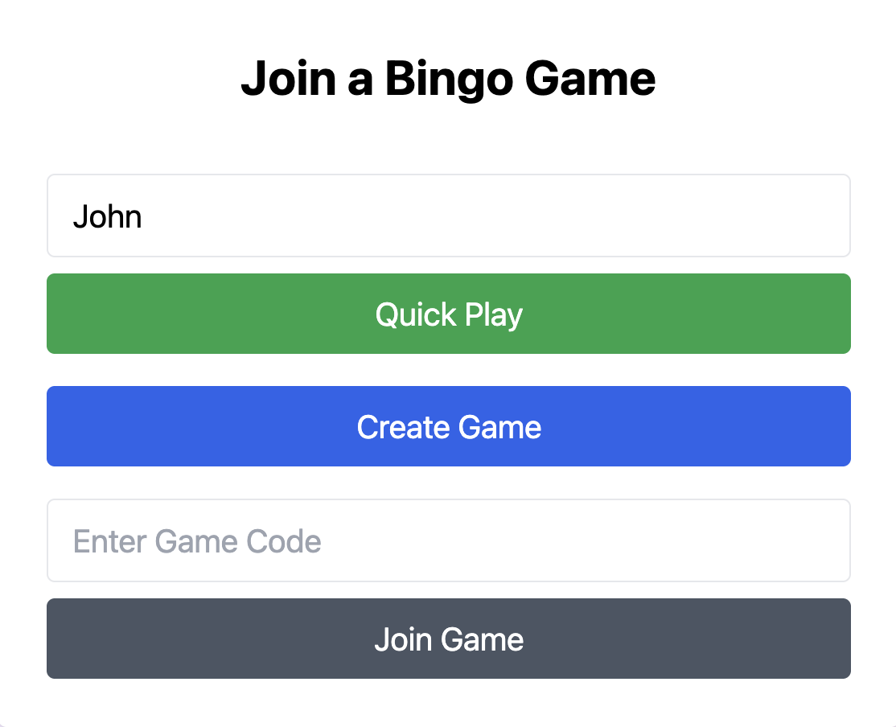
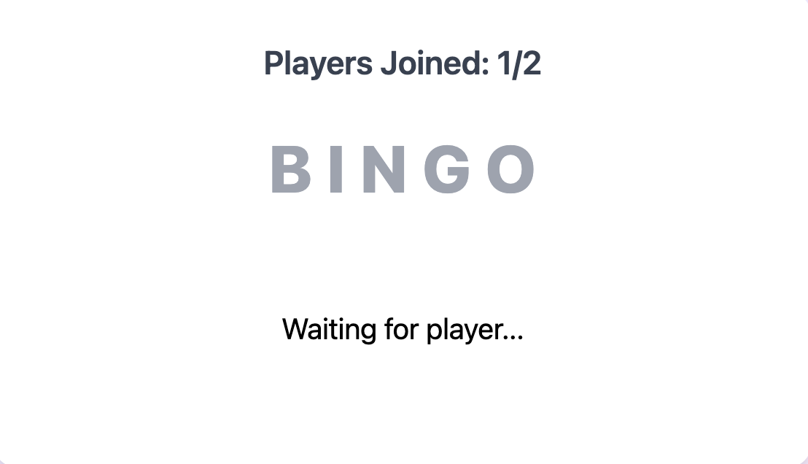
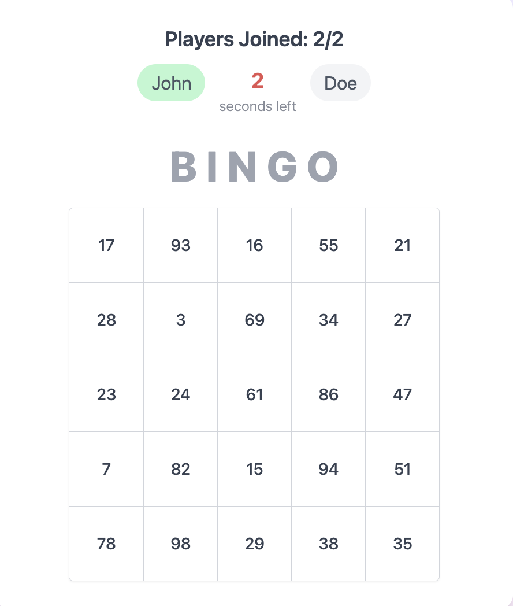
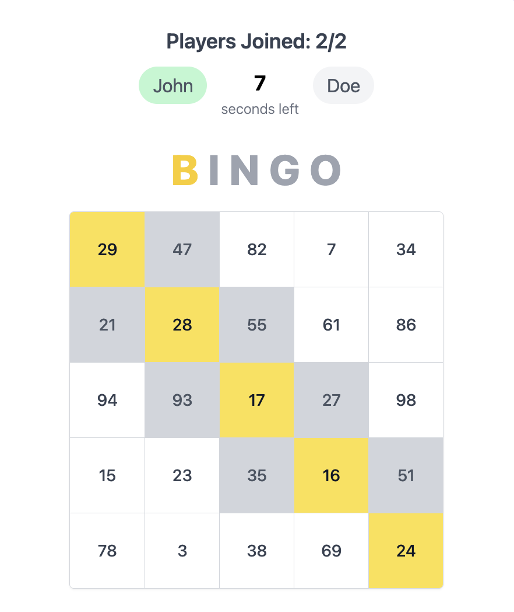

# Bingo Game

A real-time 2-player online bingo game built with Django, HTMX, and Alpine.js.

## Features

- **Real-time Gameplay**: Live game updates using WebSockets via Django Channels
- **Game Rooms**: Join games using unique game codes
- **Private Games**: Create private games for exclusive play
- **Interactive UI**: Dynamic frontend with HTMX and Alpine.js
- **5x5 Bingo Boards**: Traditional bingo gameplay with row, column, and diagonal wins
- **Turn-based Play**: Alternating turns between players
- **Session Management**: Persistent player sessions across games

## Screenshots

### Join Game Page


_The initial page where players enter their name and join or create a game_

### Waiting Room


_The waiting area where players wait for the game to start_

### Game Started


_The bingo board view when the game begins_

### Mid Game


_Gameplay in progress showing marked numbers and current game state_

### Game Result


_The final results screen showing the winner._

## Prerequisites

Before running this application, make sure you have the following installed:

- Python 3.8+
- PostgreSQL
- Redis
- Node.js (for asset compilation, if needed)

## Installation

1. **Clone the repository:**

   ```bash
   git clone <repository-url>
   cd bingo
   ```

2. **Create a virtual environment:**

   ```bash
   python -m venv venv
   source venv/bin/activate  # On Windows: venv\Scripts\activate
   ```

3. **Install Python dependencies:**

   ```bash
   pip install -r requirements.txt
   ```

4. **Set up PostgreSQL database:**

   - Create a database named `bingoprojectdb`
   - Create a user `bingoprojectadmin` with password `testpass123`
   - Or update the database settings in `bingo/settings.py`

5. **Start Redis server:**

   ```bash
   redis-server
   ```

6. **Run database migrations:**
   ```bash
   python manage.py migrate
   ```

## Running the Application

**Start the development server:**

```bash
python manage.py runserver
```

The application will be available at `http://127.0.0.1:8000`

### Running on Local Network

To allow other devices on your local network to access the application:

1. **Update ALLOWED_HOSTS in settings:**

   Edit `bingo/settings.py` and change:

   ```python
   ALLOWED_HOSTS = ['*']
   ```

2. **Run the server on all interfaces:**

   ```bash
   python manage.py runserver 0.0.0.0:8000
   ```

3. **Find your local IP address:**

   ```bash
   ipconfig getifaddr en0  # macOS
   # or
   hostname -I  # Linux
   ```

4. **Access from other devices:**

   Other devices on the same network can now access the application using your computer's IP address:
   `http://YOUR_LOCAL_IP:8000`

   _Note: Make sure your firewall allows connections on port 8000_

## Usage

1. **Join a Game:**

   - Visit the homepage
   - Enter a game code to join an existing game
   - Or create a new private game

2. **Gameplay:**

   - Players take turns calling numbers
   - Mark numbers on your bingo board as they're called
   - Get 5 in a row (horizontal, vertical, or diagonal) to win!

3. **Real-time Updates:**
   - Game state updates automatically for all players
   - No need to refresh the page

## Project Structure

```
bingo/
├── bingo/                 # Django project settings
├── game/                  # Main game application
│   ├── models.py         # Game and Player models
│   ├── views.py          # HTTP request handlers
│   ├── consumers.py      # WebSocket consumers
│   ├── templates/        # HTML templates
│   └── static/           # CSS, JS, audio files
├── static/               # Static assets
├── templates/            # Base templates
└── manage.py            # Django management script
```
