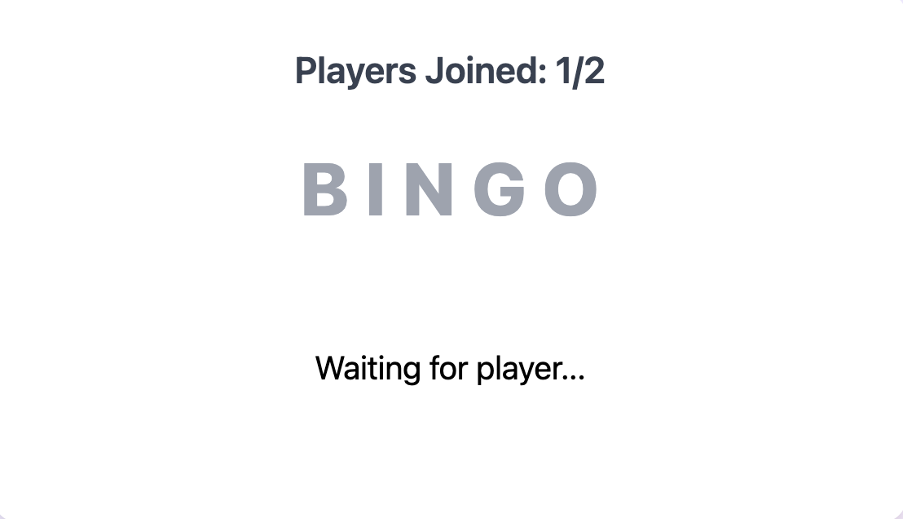
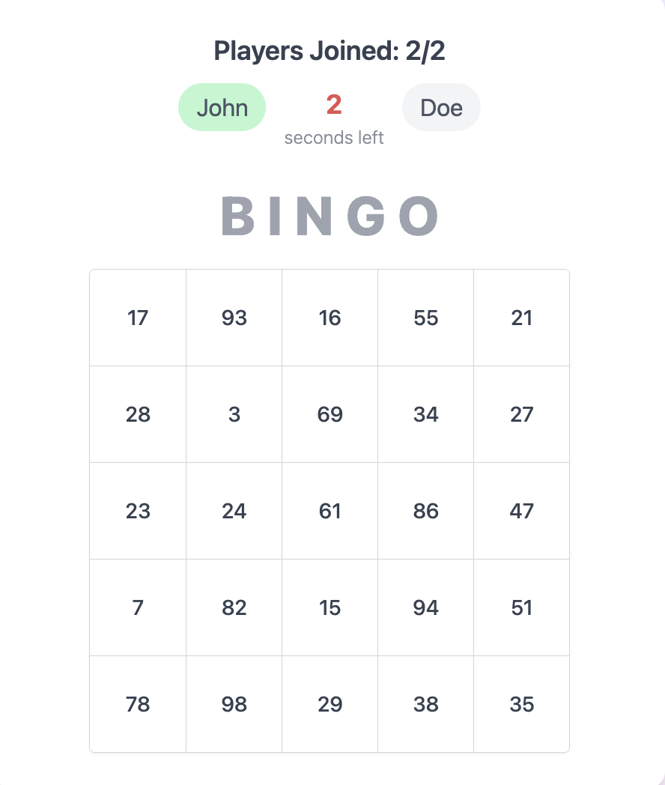
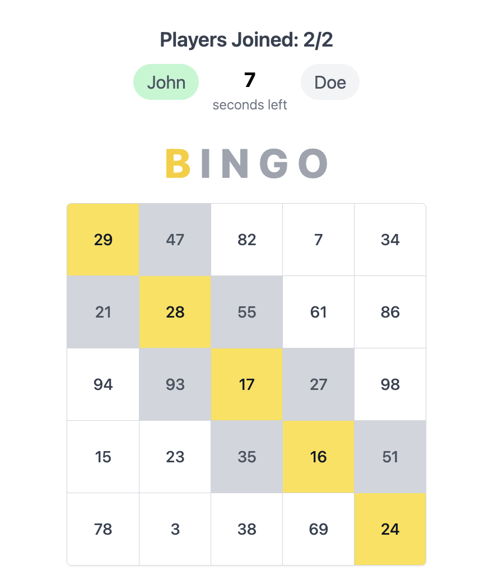

# Bingo Game

A real-time 2-player online bingo game built with Django, Django Channels, HTMX, and Alpine.js.

## Features

- Real-time gameplay using WebSockets via Django Channels
- Game rooms with shareable game codes
- Private games for invite-only play
- Turn-based 5x5 bingo board mechanics
- Live game state updates without page refresh

## Screenshots

### Join Game Page


_The initial page where players enter their name and join or create a game._

### Waiting Room


_The waiting area where players wait for the game to start._

### Game Started


_The bingo board view when the game begins._

### Mid Game


_Gameplay in progress showing marked numbers and current game state._

### Game Result


_The final results screen showing the winner._

## Quick Start (Docker Compose)

### Prerequisites

- Docker
- Docker Compose (v2)

### 1. Configure Environment

Copy the example environment file:

```bash
cp .env.example .env
```

Then update at least these values in `.env`:

- `SECRET_KEY`
- `DEBUG`
- `ALLOWED_HOSTS`
- `DB_PASSWORD`

Note: `docker-compose.yml` sets `DB_HOST=db` and `REDIS_HOST=redis` for container networking automatically.

### 2. Build and Start

```bash
docker compose up --build
```

The web app will be available at:

- `http://127.0.0.1:8000`

On startup, the web container automatically runs migrations and then starts Daphne.

### 3. Stop the Stack

```bash
docker compose down
```

To remove database volume data as well:

```bash
docker compose down -v
```

## Useful Docker Commands

Run tests:

```bash
docker compose exec web python manage.py test
```

Create a superuser:

```bash
docker compose exec web python manage.py createsuperuser
```

Create new migrations:

```bash
docker compose exec web python manage.py makemigrations
```

Apply migrations manually:

```bash
docker compose exec web python manage.py migrate
```

Follow web logs:

```bash
docker compose logs -f web
```

## Services and Ports

- `web`: Django + Daphne app on `8000`
- `db`: PostgreSQL on `5432`
- `redis`: Redis on `6379`

## Environment Variables

The app reads these variables (see `.env.example`):

- `SECRET_KEY`
- `DEBUG`
- `ALLOWED_HOSTS`
- `DB_NAME`
- `DB_USER`
- `DB_PASSWORD`
- `DB_HOST`
- `DB_PORT`
- `REDIS_HOST`
- `REDIS_PORT`

## Local Development (Without Docker)

### Prerequisites

- Python 3.12+
- PostgreSQL
- Redis

### Setup

```bash
python -m venv .venv
source .venv/bin/activate
pip install -r requirements.txt
cp .env.example .env
```

Start PostgreSQL and Redis, then run:

```bash
python manage.py migrate
python manage.py runserver
```

## Project Structure

```text
bingo/
├── bingo/                 # Django project settings
├── game/                  # Main game application
│   ├── models.py          # Game and Player models
│   ├── views.py           # HTTP request handlers
│   ├── consumers.py       # WebSocket consumers
│   └── tests/             # App tests
├── templates/             # HTML templates
├── static/                # Static assets
├── Dockerfile
├── docker-compose.yml
├── entrypoint.sh
└── manage.py
```
